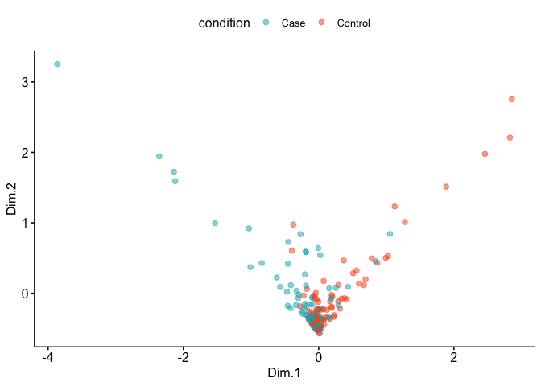
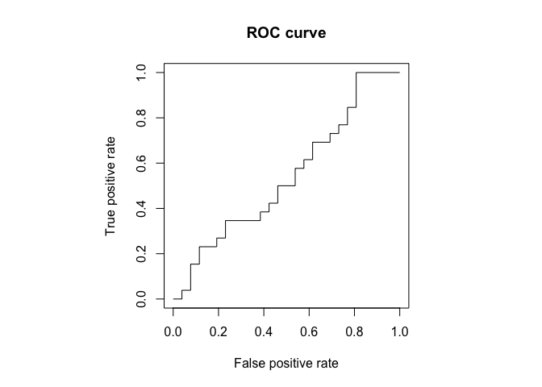
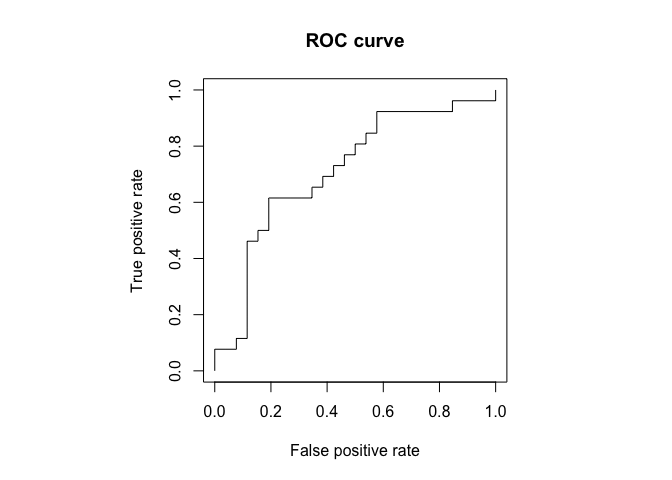
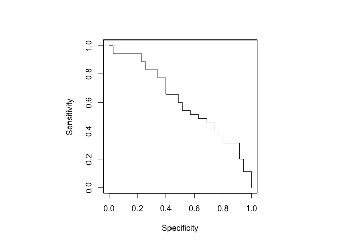

miRNA analysis on breast cancer data
================
Emmanuel Dumont, PhD

## Introduction to the problem

Like many areas in genomics (the study of the genome sequence) and
transcriptomics (the study of the genome expression), we look at a
high-dimensionality problem where the number of features is much larger
than the number of samples in the dataset.

In this particular case, our dataset comes from the expression count of
micro-RNAs (“miRNAs”) that were extracted from formalin-fixed
paraffin-embedded tissue specimens. All tissue specimens come from
women’s breast diagnosed with cancer. “Control” tissues have
non-metastatic breast cancer while “Case” tissues have metastatic breast
cancer. Tissues were paired in (Case, Control) when the cancers had the
same tumor grade and came from women with the age. miRNAs are
single-stranded non-coding RNA with about two dozen nucleotides.

The dataset comprises of 290 samples, 210 of which are paired (samples
came from women with the same age and same tumor type but different
metastatic progression). The goal of this project is to find a set of
miRNAs whose expression levels can be used to differentiate between
healthy patients and patients with breast cancer.

The work is divided in three steps: 1. Prepare the dataset and divide it
into training and test sets. 2. Clustering the miRNAs 3. Apply
machine-learning models on representatives of the clusters.

As we will see below, a visualization method widely used in RNA-seq
(t-distributed stochastic neighbor embedding) was not able to visually
identify clusters between Cases and Controls. Therefore, as expected,
all clustering approaches combined with machine-learning models did not
yield any good predictive results.

## Import, clean the data, and filter the data based on coverage

### Import the matrices of miRNA expression counts per sample

In this file, the NAs were replaced with zeros.

After importing, we concatenate the first two columns (mir\_id and
mir\_seq) to have a unique identifier per miRNA. We then rename each row
with the miRNA new name.

``` r
# Raw counts where NAs were replaced with zeros
rawCounts <- read.csv(file = 'raw_data/miRNa_count_noNA.txt',
                       sep = '\t',header = TRUE)

# minimize all caps (better when using the package DESEq2)
colnames(rawCounts) = tolower(colnames(rawCounts))

# Obtain the sample names (The first two columns are the miRNA ID and its sequence)
sampleNames <- colnames(rawCounts)[3:ncol(rawCounts)]

# Check that every sample is named uniquely
if (length(unique(sampleNames)) != length(sampleNames)){
  print("CHECK. There are duplicate names")
}

# Concatenate the first two columns of the miR dataframe to create 
# a unique ID per isoform
rawCounts$mir_rna <- paste(rawCounts$mir_id, "_", rawCounts$mir_seq, sep = "")

# Re-construct a new set of columns
rawCounts = rawCounts[, c('mir_rna', sampleNames)]

# Remove the "_count" from the samples' names
names(rawCounts) <- gsub("_count", "", names(rawCounts))

# Use the first column as row names
rownames(rawCounts) <- rawCounts$mir_rna
rawCounts <- rawCounts[,-1]

# Delete variables.
rm(sampleNames)

nbSamplesRaw <- ncol(rawCounts)
nbmiRNAsRaw <- nrow(rawCounts)

head(rowCounts)
```

    ##                                                                                               
    ## 1 new("standardGeneric", .Data = function (x, rows = NULL, cols = NULL,                       
    ## 2     value = TRUE, na.rm = FALSE, ...)                                                       
    ## 3 standardGeneric("rowCounts"), generic = structure("rowCounts", package = "MatrixGenerics"), 
    ## 4     package = "MatrixGenerics", group = list(), valueClass = character(0),                  
    ## 5     signature = "x", default = NULL, skeleton = (function (x,                               
    ## 6         rows = NULL, cols = NULL, value = TRUE, na.rm = FALSE,

### Import the sample info file

In the matrix above, we do not know if a sample is “Control”
(non-metastatic breast cancer) or “Case” (metastatic breast cancer). The
sample info file will give us this information.

There are 137 “Case” samples and 125 “Control” samples. There is another
sample info file where 224 samples were balanced between case and
control samples and paired with each other. However replicates were
present in the file and they need to be removed. Samples were paired if
they came from women who have the same age and same tumor type but a
different outcome (metastatic vs non-metastatic breast cancer).

``` r
# Pick the sample info file to work with
pairedSamples <- TRUE # TRUE OR FALSE

if (pairedSamples == TRUE) {
  sampleFileName <- "raw_data/sample_info_dc_paired_analysis.csv"
} else {
  sampleFileName <- "raw_data/sample_info_DC.csv"
}

# We import the file created by CD who flagged the samples to remove from the analysis and flagged the samples as "Case" or "Control"
sampleInfo <- read.csv(file = sampleFileName, header = TRUE)

# Remove the samples that neither case or control
sampleInfo = sampleInfo[sampleInfo$status %in%c('Case', 'Control'), ]

# Keep the columns of interest
sampleInfo = sampleInfo[, c('subsample','status', 'id', 'exclude')]

# Rename the columns
colnames(sampleInfo) = c('sample','condition', 'id', 'exclude')

# Remove the samples identified to be excluded
sampleInfo = sampleInfo[is.na(sampleInfo$exclude), ]

# Write names in lower case
sampleInfo$sample = tolower(sampleInfo$sample)
sampleInfo$id = tolower(sampleInfo$id)

# Rename samples so that "OL_sRNA_TMM8_k017Y" which is a "Case" becomes "k017_Case"
sampleInfo$sampleName <- paste(str_extract(
        sampleInfo$id, "k\\d+"), "_",
        sampleInfo$condition, sep = "")

if (pairedSamples == TRUE) {
  # Remove the replicate samples (at random between 2 replicates)
  #sampleInfo = sampleInfo[!duplicated(sampleInfo$sample),]

  # Remove duplicate samples
  sampleInfo = sampleInfo[!duplicated(sampleInfo$sampleName),]

}

# At this point the dataset should be balanced.
if (dim(sampleInfo[sampleInfo$condition == 'Case', ])[1] == dim(sampleInfo[sampleInfo$condition == 'Control', ])[1]) {
  cat("The dataset is balanced")
} else {
  cat("The dataset is NOT balanced")
}
```

    ## The dataset is balanced

``` r
cat("There are ", length(sampleInfo[sampleInfo$condition == 'Case', ]$sample), "Case samples", "and", length(sampleInfo[sampleInfo$condition == 'Control', ]$sample), "Control samples")
```

    ## There are  105 Case samples and 105 Control samples

``` r
# Keep only the column of the new name and the status
sampleInfo = sampleInfo[, c('sample', 'sampleName', 'condition')]
colnames(sampleInfo) = c('sampleOldName', 'sampleNewName', 'condition')
```

Now, we remove from the matrix of counts all samples that are not in the
sampleInfo file. After that, we’re left with 262 samples in the matrix
of raw counts.

``` r
# Keep the samples of the count matrix that are in the sample info file.
rawCountsId = rawCounts[names(rawCounts) %in% sampleInfo$sampleOldName]

# Identify the samples that are not paired.
idSamples <- colnames(rawCountsId)
allSamples <- colnames(rawCounts)
excludedSamples <- allSamples[!(allSamples %in% idSamples)]
cat("There are", length(excludedSamples), "samples excluded from the dataset")
```

    ## There are 78 samples excluded from the dataset

``` r
# Rename columns of the count matrix.
tmp <- as.data.frame(colnames(rawCountsId))
tmp$newName = apply(tmp, 1, function(x) sampleInfo[sampleInfo$sampleOldName == x, 'sampleNewName'])

colnames(rawCountsId) = tmp$newName

rm(tmp)
```

### Filter the miRNAs by their coverage and prepare a normalized matrix

We remove miRNAs that do not show at least 50 counts in one sample. We
also remove miRNAs where the count is above the 99% percentile after
removing the poorly-expressed miRNAs.

That leaves us with 5k-30k miRNAs (down from 635k), depending on the
parameters.

``` r
# Parameters
minCount <- 100 
maxPerc <- 0.9

samplesAnalysis <- colnames(rawCountsId)

# # We start by making a copy of the dataframe
rawCountsIdCov <- rawCountsId

# Create a column for the max number of counts for a given miRNA
rawCountsIdCov$maxRow = apply(rawCountsIdCov, 1, function(x) max(x))

# Summary of the max number 
summary(rawCountsIdCov$maxRow)
```

    ##      Min.   1st Qu.    Median      Mean   3rd Qu.      Max. 
    ##       0.0       1.0       1.0      24.1       2.0 1976210.0

``` r
# Filter the matrix of counts out of miRNAs whose max is not at least minCount
rawCountsIdCov = rawCountsIdCov[rawCountsIdCov$maxRow >= minCount, ] 

# Summary of max counts per miRNA after removing the barely-expressed miRNAs
summary(rawCountsIdCov$maxRow)
```

    ##    Min. 1st Qu.  Median    Mean 3rd Qu.    Max. 
    ##     100     150     263    2736     748 1976210

``` r
# Identify the upper bound for the max number of counts
maxCount <- quantile(rawCountsIdCov$maxRow, maxPerc) 

# Filter the matrix of row counts of miRNAs whose max is less than maxCounts
rawCountsIdCov = rawCountsIdCov[rawCountsIdCov$maxRow <= maxCount, ] 

# Summary of max counts per miRNA after removing the over-expressed miRNAs
#summary(rawCountsIdCov$maxRow)
```

We then normalize the matrix of counts per miRNA (between 0 and 1)

``` r
#-------------------------------
# Prepare a normalized matrix (need to convert to numeric first)
countsNorm <- mutate_all(rawCountsIdCov, function(x) as.numeric(as.character(x)))

# We normalize each row (and we need to use the transpose function)
countsNorm = t(apply(
  countsNorm, 1, function(x) round(
                          (x-min(x))/(max(x)-min(x)), 
                          3)))

# Convert the "large matrix" into a dataframe
countsNorm = as.data.frame(countsNorm)

# Remove the column with the maxRow
rawCountsIdCov = rawCountsIdCov[ , samplesAnalysis]
countsNorm = countsNorm[ , samplesAnalysis]
```

## Split the dataset into training (66.66% of data) and test (33.33% of data) sets.

To make sure we avoid over-fitting, we split the dataset into a training
and a test datasets.

``` r
# set seed to ensure reproducible results
set.seed(123)

if (pairedSamples == TRUE) {
  # For paired analysis, we randomize the pairs of samples
  sampledNames <- sample(unique(str_extract(colnames(countsNorm), "k\\d+")))

} else {
  # For unpaired analysis, we randomize all samples
sampledNames <- sample(colnames(countsNorm))
}


# Take 20% of these sample positions at random for the test dataset
sampleIndices <- 1:length(sampledNames)
testIndices <- sample(sampleIndices, trunc(length(sampleIndices)/3))

testSamples <- sampledNames[testIndices]
trainSamples <- sampledNames[-testIndices]

# Create dataframes for testing and training
countsTest = rawCountsIdCov[grepl(paste(testSamples, collapse = "|"), colnames(rawCountsIdCov))]
countsTrain = rawCountsIdCov[grepl(paste(trainSamples, collapse = "|"), colnames(rawCountsIdCov))]

normTest = countsNorm[grepl(paste(testSamples, collapse = "|"), colnames(countsNorm))]
normTrain = countsNorm[grepl(paste(trainSamples, collapse = "|"), colnames(countsNorm))]
```

## Identify representative miRNAs to be used in predictive models

Using boundaries on the number of counts we were able to decrease the
number of miRNAs from 635k to 28k but there are still 100x more features
than samples, which is termed the “curse of dimensionality”.

First we define a function to determine if a column is a Control or Case
based on its name

``` r
# Function to figure out if the sample is a "Control" or a "Case"
findCondition <- function(x) {
  if ( grepl('Case', x) ) {
    answer = "Case"
  } else {
      answer = "Control"
  } 
  return (answer)}
```

### Plot the data in 2 dimensions using t-Distributed Stochastic Neighbor Embedding

t-Distributed Stochastic Neighbor Embedding (tSNE) is a non-linear
dimensionality reduction technique widely used in single cell data
analysis to visualize high-dimensional data in 2 dimensions.

As shown below the miRNAs are unable to cluster the two populations
(Case and Control), leaving very little hope that we would be able to
build a suitable predictive model.

``` r
set.seed(42)

# Create a dataset where rows are sample and columns miRNA
tsneSet <- as.data.frame(t(normTrain))
tsneSet$sample <- rownames(tsneSet)
tsneSet$condition = apply(tsneSet['sample'], 1, findCondition)
tsneSet = tsneSet[, !names(tsneSet) %in% c('sample') ]

# Create a matrix without the column of sample conditions
tsneMatrix <- as.matrix(tsneSet[,1:length(colnames(tsneSet))-1])

# Calculate tsne
tsneOut <- Rtsne(tsneMatrix, pca = FALSE, perplexity = 30, theta = 0) # Run TSNE

# Plot in 2D
plot(tsneOut$Y,col=as.factor(tsneSet$condition), asp=1)
```

<!-- -->

### Method \#1 (naive): T-test on each miRNA between the Cases and Controls

This method is the most intuitive: for each miRNA, we measure if there
is a significant differently-expressed measurement between the Cases and
the Controls.

``` r
ttestDataset = normTrain

# Lists of samples that are "Control"  and  "Case"
controlsTrain = ttestDataset[grepl("Control", colnames(ttestDataset))]
casesTrain = ttestDataset[grepl("Case", colnames(ttestDataset))]

# Create a column with the row names
ttestDataset$mirna = rownames(ttestDataset)

# Compute the  p-value of a t-test for each miRNA
suppressWarnings(ttestDataset$pValue <- apply(ttestDataset, 1,
                              function(x) round(wilcox.test(
                                as.numeric(controlsTrain[x['mirna'], ]),
                                as.numeric(casesTrain[x['mirna'], ]),
                                paired = pairedSamples,
                                alternative = "two.sided")$p.value, 3)))

ttestDataset$controlMean <- apply(ttestDataset, 1,
                              function(x) round(mean( 
                                as.numeric( controlsTrain[x['mirna'], ] ), 
                                na.rm = FALSE ),3))

ttestDataset$caseMean <- apply(ttestDataset, 1,
                              function(x) round(mean( 
                                as.numeric(casesTrain[x['mirna'], ]), 
                                na.rm = FALSE ), 3))

ttestDataset$effectSize <- round(ttestDataset$caseMean / ttestDataset$controlMean, 3)
                              
# Correct for multiple testing using Benjamini & Hochberg 
# criteria (commented because not used)
ttestDataset$adjPValue <- p.adjust(ttestDataset$pValue, method = "BH")

# Delete intermediary files
#rm(controlsTrain, casesTrain)

# Display statistics on the effect size
summary(ttestDataset$effectSize)
```

    ##    Min. 1st Qu.  Median    Mean 3rd Qu.    Max.    NA's 
    ##   0.000   0.696   0.895     Inf   1.149     Inf       7

``` r
# Display statistics on the p-value
summary(ttestDataset$pValue)
```

    ##    Min. 1st Qu.  Median    Mean 3rd Qu.    Max.    NA's 
    ##  0.0000  0.1960  0.4170  0.4448  0.6790  1.0000       1

``` r
#----------------------------------------------------
# Remove the miRNA where the effect size is NA
ttestDatasetFilt = ttestDataset[!is.na(ttestDataset$effectSize), ]

#----------------------------------------------------

# Pick min effect size
minEffectSize = 2 

# Pick max p-value
maxPValue = 0.05

# Filter based on effect size
ttestDatasetFilt = ttestDatasetFilt[ttestDatasetFilt$effectSize > minEffectSize |
                           ttestDatasetFilt$effectSize < 1/minEffectSize, ]

# Filter based on p-value
ttestDatasetFilt = ttestDatasetFilt[ttestDatasetFilt$pValue < maxPValue, ]

# Create an array of the selected miRNAs
ttestmiRNA <- rownames(ttestDatasetFilt)
cat("There are", length(ttestmiRNA), "miRNA selected by the t-test methodology")
```

    ## There are 148 miRNA selected by the t-test methodology

### Method \#2 (existing bioinformatics package): DESeq2

``` r
# DESeq2 requires the matrix of raw counts as an input
deseqCounts <- countsTrain + 1 # +1 to avoid errors (the matrix cannot contain zeros)

# Sample info file for DESeq2
deseqSampleInfo <- as.data.frame(colnames(deseqCounts))
colnames(deseqSampleInfo) = c('sample')
deseqSampleInfo$condition = apply(deseqSampleInfo['sample'], 1, findCondition)

## DESeq2 Analysis
dds <- DESeqDataSetFromMatrix(deseqCounts, 
                                  colData = deseqSampleInfo, 
                                  design = ~ condition)
```

    ## converting counts to integer mode

    ## Warning in DESeqDataSet(se, design = design, ignoreRank): some variables in
    ## design formula are characters, converting to factors

``` r
dds$condition <- relevel(dds$condition, ref = "Control")

# Compute the up and down regulated miRNAs
dds <- DESeq(dds)
```

    ## estimating size factors

    ## estimating dispersions

    ## gene-wise dispersion estimates

    ## mean-dispersion relationship

    ## -- note: fitType='parametric', but the dispersion trend was not well captured by the
    ##    function: y = a/x + b, and a local regression fit was automatically substituted.
    ##    specify fitType='local' or 'mean' to avoid this message next time.

    ## final dispersion estimates

    ## fitting model and testing

    ## -- replacing outliers and refitting for 503 genes
    ## -- DESeq argument 'minReplicatesForReplace' = 7 
    ## -- original counts are preserved in counts(dds)

    ## estimating dispersions

    ## fitting model and testing

``` r
## DESeq2 results
deseqModel <- results(dds, filterFun = ihw, alpha = 0.05, name = "condition_Case_vs_Control")
summary(deseqModel)
```

    ## 
    ## out of 4537 with nonzero total read count
    ## adjusted p-value < 0.05
    ## LFC > 0 (up)       : 67, 1.5%
    ## LFC < 0 (down)     : 107, 2.4%
    ## outliers [1]       : 0, 0%
    ## [1] see 'cooksCutoff' argument of ?results
    ## see metadata(res)$ihwResult on hypothesis weighting

``` r
deseqmiRNATable <- as.data.frame(deseqModel)

## Function to grab results
get_upregulated <- function(df){
    key <- intersect(rownames(df)[which(df$log2FoldChange>=1)],
              rownames(df)[which(df$pvalue<=0.05)])

    results <- as.data.frame((df)[which(rownames(df) %in% key),])
    return(results)
  }
get_downregulated <- function(df){
  key <- intersect(rownames(df)[which(df$log2FoldChange<=-1)],
            rownames(df)[which(df$pvalue<=0.05)])

  results <- as.data.frame((df)[which(rownames(df) %in% key),])
  return(results)
}

mirnaUpregDESeq <- get_upregulated(deseqmiRNATable)
mirnaDownregDESeq <- get_downregulated(deseqmiRNATable)

# Normalized counts from DESeq matrix
deseqNormTrain <- counts(dds, normalized = T)

deseqmiRNA <- c(rownames(mirnaUpregDESeq), rownames(mirnaDownregDESeq)) 

cat("There are", length(deseqmiRNA), "miRNAs selected by DESeq2")
```

    ## There are 189 miRNAs selected by DESeq2

``` r
#miR_upreg$miRNA_id <- rownames(miR_upreg)
#miR_downreg$miRNA_id <- rownames(miR_downreg)
#miR_upreg <- miR_upreg[,c(8,1,2,3,4,5,6,7)]
#miR_downreg <- miR_downreg[,c(8,1,2,3,4,5,6,7)]

# Write the results in txt files
#dir.create("deseq2results/")
#write.table(deseqNormTrain, "deseq2results/deseqNormTrain.txt", quote = F, sep = "\t")
#write.table(mirnaUpregDESeq, "deseq2results/mirnaUpregDESeq.txt", quote = F, sep = "\t", row.names = F)
#write.table(mirnaDownregDESeq, "deseq2results/mirnaDownregDESeq.txt", quote = F, sep = "\t", row.names = F)
```

### Method \#3: HDBSCAN clustering

HDBSCAN is a clustering technique relying on density (in high
dimensions) widely used in single-cell RNA-seq. When applied to our
dataset, it is unable to find any cluster.

``` r
# Create a dataset where rows are sample and columns miRNA
hdbSet <- as.data.frame(t(normTrain))
hdbSet$sample <- rownames(hdbSet)
hdbSet$condition = apply(hdbSet['sample'], 1, findCondition)
hdbSet = hdbSet[, !names(hdbSet) %in% c('sample') ]

# Create a matrix without the column of sample conditions
hdbSet <- as.matrix(hdbSet[,1:length(colnames(hdbSet))-1])

clusters <- hdbscan(hdbSet, minPts = 100)

# Display the number of clusters -- Could not find any clusters
clusters
```

    ## HDBSCAN clustering for 140 objects.
    ## Parameters: minPts = 100
    ## The clustering contains 0 cluster(s) and 140 noise points.
    ## 
    ##   0 
    ## 140 
    ## 
    ## Available fields: cluster, minPts, cluster_scores, membership_prob,
    ##                   outlier_scores, hc

### Filter datasets with the selected miRNAs

``` r
# Pick the miRNAs to be used in the models: ttestmiRNA, deseqmiRNA
mirnaModel <- deseqmiRNA # deseqmiRNA OR ttestmiRNA OR hdbmiRNA

# Matrices of counts
countsTrainFilt = countsTrain[mirnaModel, ]
countsTestFilt = countsTest[mirnaModel, ]

# Matrices of normalized counts
normTestFilt <- normTest[mirnaModel, ]
normTrainFilt <- normTrain[mirnaModel, ]
```

## Predictions using machine-learning techniques

### Prepare the training and test datasets for the models

``` r
# Transpose the datasets for feeding the models
trainingSet <- as.data.frame(t(normTrainFilt))
testSet <- as.data.frame(t(normTestFilt))

# Create a column with the samples names
trainingSet$sample = rownames(trainingSet)
testSet$sample = rownames(testSet)

# Apply function to create a new column
trainingSet$condition = apply(trainingSet['sample'], 1, findCondition)
testSet$condition = apply(testSet['sample'], 1, findCondition)

# New column names (re-ordered)
trainingSet = trainingSet[, c('condition', mirnaModel)]
testSet = testSet[, c('condition', mirnaModel)]

# Create a vector of the labels in the test dataset (control = 0, case = 1)
testLabels = ifelse(testSet$condition == "Control", 0, 1)
trainingLabels = ifelse(trainingSet$condition == "Control", 0, 1)
```

### Visualize the data using multi-dimensional scaling on the training dataset

``` r
# Create MDS dataset in 2 dimensions
mds <- trainingSet %>%
  dist() %>%
  cmdscale() %>%
  as_tibble()
```

    ## Warning in dist(.): NAs introduced by coercion

    ## Warning: The `x` argument of `as_tibble.matrix()` must have unique column names if `.name_repair` is omitted as of tibble 2.0.0.
    ## Using compatibility `.name_repair`.
    ## This warning is displayed once every 8 hours.
    ## Call `lifecycle::last_lifecycle_warnings()` to see where this warning was generated.

``` r
colnames(mds) <- c("Dim.1", "Dim.2")
# Add the condition to the dataframe
mds$condition <- trainingSet$condition
mds$condition = as.factor(mds$condition)

# Plot MDS for all data
p <- ggscatter(mds, x = "Dim.1", y = "Dim.2",
        size = 2,
        alpha = 0.5,
        color = 'condition',
        palette =  c("#00AFBB", "#FC4E07"),
        repel = TRUE
        )

print(p)
```

<!-- -->

### Lasso logistic regression

Because sequencing of miRNAs is cumbersome and expensive, our goal is to
select as few features as possible. Therefore, we run a penalized
logistic regression using the lasso regression. In this regression, the
coefficients of some less contributive variables are forced to be
exactly zero. Only the most significant variables are kept in the final
model.

``` r
# Dumy code categorical predictor variables
 xTraining <- model.matrix(condition~., trainingSet)[,-1]

# We build cvLasso to find the optimal Lambda
cvLasso <- cv.glmnet(xTraining, trainingLabels, family = "gaussian")

# Build model (Family can be binomial, poisson, gaussian)
lassoModel <- glmnet(xTraining, trainingLabels, alpha = 1, family = "binomial", lambda = cvLasso$lambda.min)

xTest <- model.matrix(condition ~., testSet)[,-1]
probabilities <- lassoModel %>% predict(newx = xTest, type="response")
predictedClasses <- ifelse(probabilities > 0.5, "Case", "Control")

# Confusion matrix
table(pred = predictedClasses, true = testSet[, c('condition')])
```

    ##          true
    ## pred      Case Control
    ##   Case      13      12
    ##   Control   22      23

``` r
# Model accuracy
modelAccuracy = mean(predictedClasses == testSet$condition)
cat("The accuracy is", modelAccuracy, "\n")
```

    ## The accuracy is 0.5142857

``` r
# ROC curve
pred <- prediction(as.vector(probabilities), as.vector(testLabels))
perf <- performance(pred,"tpr","fpr")
par(pty="s")


# Plot the ROC curve
plot(perf,  main = "ROC curve")
```

<!-- -->

``` r
#lines(c(0,1),c(0,1),col = "gray", lty = 4 )

# plot the no-prediction line
lassoAUC <- performance(pred, measure = "auc")
lassoAUC <- lassoAUC@y.values[[1]]

cat("The AUC is", lassoAUC)  
```

    ## The AUC is 0.52

``` r
# Regression parameters  
#coef(cv_lasso, cv_lasso$lambda.min)


# precision/recall curve (x-axis: recall, y-axis: precision)
perf <- performance(pred, "prec", "rec")
plot(perf)
```

<!-- -->

``` r
# sensitivity/specificity curve (x-axis: specificity,
# y-axis: sensitivity)
perf <- performance(pred, "sens", "spec")
plot(perf)
```

<!-- -->

``` r
# Coefficients
#coef(cvLasso, cvLasso$lambda.min)
```

### Support vector machines

``` r
# Treat the condition as a factor
trainingSet$condition = as.factor(trainingSet$condition)

# SVM kernels are polynomial, linear, radial, sigmoid
svmModel <- svm(condition ~ ., data = trainingSet, type = 'C-classification', 
                kernel = "polynomial", cost = 10, gamma = 1, probability = TRUE)

# Generate predictions on the test dataset
svmPred <- predict(svmModel, 
                    testSet[ , !names(testSet) %in% c('condition')], 
                   probability = TRUE)

# Confusion matrix
table(pred = svmPred, true = testSet[, c('condition')])
```

    ##          true
    ## pred      Case Control
    ##   Case      31      27
    ##   Control    4       8

``` r
# Model accuracy
svmAccuracy = mean(svmPred == testSet$condition)
cat("The accuracy is", svmAccuracy, "\n")
```

    ## The accuracy is 0.5571429

``` r
# ROC
pred <- prediction(as.data.frame(attr(svmPred, "probabilities"))$Case, testLabels)
perf <- performance(pred,"tpr","fpr")
par(pty="s")

# Plot the ROC curve
plot(perf,  main = "ROC curve")
```

<!-- -->

``` r
# plot the no-prediction line
#lines(c(0,1),c(0,1),col = "gray", lty = 4 )
svmAUC <- performance(pred, measure = "auc")
svmAUC <- svmAUC@y.values[[1]]

cat("The AUC is", svmAUC)  
```

    ## The AUC is 0.6155102

``` r
# Regression parameters  
#coef(cv_lasso, cv_lasso$lambda.min)


# precision/recall curve (x-axis: recall, y-axis: precision)
perf <- performance(pred, "prec", "rec")
plot(perf)
```

<!-- -->

``` r
# sensitivity/specificity curve (x-axis: specificity,
# y-axis: sensitivity)
perf <- performance(pred, "sens", "spec")
plot(perf)
```

<!-- -->

### Regression trees

``` r
## Regression tree
rpartModel <- rpart(condition ~ ., data = trainingSet)
rpartPred <- predict(rpartModel, 
                     testSet[ , !names(testSet) %in% c('condition')], type = "class")

# Confusion matrix for rpart
table(pred = rpartPred, true = testSet[, c('condition')])
```

    ##          true
    ## pred      Case Control
    ##   Case      19      21
    ##   Control   16      14

``` r
# Accuracy
rpartAccuracy = mean(rpartPred == testSet$condition)
cat("The accuracy is", rpartAccuracy, "\n")
```

    ## The accuracy is 0.4714286

## Conclusion

The miRNAs were not predictive of the chances of a metastatic breast
cancer.
