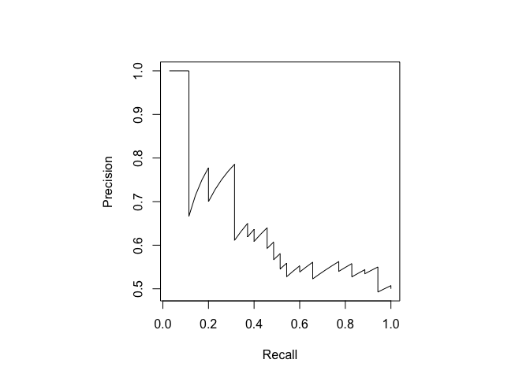

miRNA analysis on breast cancer data
================
Emmanuel Dumont, PhD

## Introduction to the problem

Like many areas in genomics and transcriptomics (the study of the genome
expression), we look at a high-dimensionality problem where the number
of features is at least two orders of magnitude larger than the number
of samples in the dataset.

In this particular case, our dataset comes from the profiling of
micro-RNAs (“miRNAs”) that were extracted from extracellular vesicles
circulating in whole blood among a population of women who are divided
in two groups: healthy and breast cancer. miRNAs are single-stranded
non-coding RNA with about two dozenf of nucleotides.

The goal of this project is to find a set of miRNAs whose expression
levels can be used to differentiate between healthy patients and
patients with breast cancer.

We present here two classification methods to identify
differentialy-expressed miRNAs between the two populations and several
machine-learning approaches to use these miRNAs into a model able to
stratify these populations.

Import libraries

## Import and clean the data

### File import

Import the dataframe of the read count per sample per miRNA from which
we replaced the “NA” values with “zeros” and the dataframe of normalized
counts (by the total number of RNAs per sample) where each miRNA must
have at least a count of 10 raw counts in any sample. Note that
Catherine cleaned the dataset to ensure it is balanced between Cases and
Controls.

``` r
counts_df_raw <- read.csv(file = 'raw_data/miRNa_count_noNA.txt',
                       sep = '\t',header = TRUE)

norm_av_df_raw <- read.csv(file = 'raw_data/miRNa_per_million_count_noNA_10x_averaged.txt', 
                       sep = '\t',header = TRUE)

# Head of the matrix of counts
head(counts_df_raw[1:3,1:4])
```

    ##        mir_id              mir_seq OL_sRNA_TMM1_k063G_count
    ## 1 bhv1-mir-B1  CGGgGTTGGCGGCCGtCGG                        0
    ## 2 bhv1-mir-B1 GCGTTGGCGGgCGaCGGGAA                        0
    ## 3 bhv1-mir-B1   GTCCTCGGCGTgGcCGGC                        0
    ##   OL_sRNA_TMM1_k063Y_count
    ## 1                        0
    ## 2                        0
    ## 3                        0

``` r
# Head of the matrix of normalized counts where duplicate samples were averaged
head(norm_av_df_raw[1:3,1:4])
```

    ##         mir_id                mir_seq K017Y_17_Case K017G_17_Control
    ## 1 hsa-let-7a-1 aGAGGTAGTAGGTTGTAcAGTT             0                9
    ## 2 hsa-let-7a-1   aGAGGTAGTAGGTTGTATAG             1                0
    ## 3 hsa-let-7a-1  aGAGGTAGTAGGTTGTATAGT            11              108

### Data cleaning

#### Matrix of counts.

We concatenate the mir\_id and mir\_seq to have a unique identifier per
miRNA and we name each row with the miRNA new name.

``` r
#Create a copy
counts_df <- counts_df_raw

# Obtain the column names
colnames <- colnames(counts_df)

# Obtain the names of the samples
sample_names = colnames[3:ncol(counts_df)]

# Check that every sample is named uniquely
print("Do we have unique identifiers for miRNAs?:")
```

    ## [1] "Do we have unique identifiers for miRNAs?:"

``` r
length(unique(sample_names)) == length(sample_names) ## Expect TRUE
```

    ## [1] TRUE

``` r
# Concatenate the first two columns of the miR dataframe to create 
# a unique ID per isoform
counts_df$mir_rna <- paste(counts_df$mir_id, "_", counts_df$mir_seq, sep = "")

# Re-construct a new set of columns
new_colnames = c('mir_rna', sample_names)

# Update the dataframe
counts_df = counts_df[,new_colnames]

# Remove the "_count" from the samples' names
names(counts_df) <- gsub("_count", "", names(counts_df))

# Use the first column as row names
rownames(counts_df) <- counts_df$mir_rna
counts_df <- counts_df[,-1]

# minimize all caps (used in DESEq2)
tmp <- colnames(counts_df)
tmp = tolower(tmp)
colnames(counts_df) = tmp
rm(tmp)
```

#### Matrix of normalized counts (prepared by Catherine)

We concatenate the mir\_id and mir\_seq to have a unique identifier per
miRNA and we name each row with the miRNA new name.

``` r
#Create a copy
norm_av_df <- norm_av_df_raw

# Obtain the column names
colnames <- colnames(norm_av_df)

# Obtain the names of the samples
sample_names = colnames[3:ncol(norm_av_df)]

# Check that every sample is named uniquely
length(unique(sample_names)) == length(sample_names) ## Expect TRUE
```

    ## [1] TRUE

``` r
# Concatenate the first two columns of the miR dataframe to create 
# a unique ID per isoform
norm_av_df$mir_rna <- paste(norm_av_df$mir_id, "_", 
                                 norm_av_df$mir_seq, sep = "")

# Re-construct a new set of columns
new_colnames = c('mir_rna', sample_names)

# Update the dataframe
norm_av_df = norm_av_df[, new_colnames]

# Use the first column as row names
rownames(norm_av_df) <- norm_av_df$mir_rna
norm_av_df <- norm_av_df[,-1]

# Head of the data frame
head(norm_av_df[1:3,1:4])
```

    ##                                     K017Y_17_Case K017G_17_Control
    ## hsa-let-7a-1_aGAGGTAGTAGGTTGTAcAGTT             0                9
    ## hsa-let-7a-1_aGAGGTAGTAGGTTGTATAG               1                0
    ## hsa-let-7a-1_aGAGGTAGTAGGTTGTATAGT             11              108
    ##                                     K029G_29_Case K029Y_29_Control
    ## hsa-let-7a-1_aGAGGTAGTAGGTTGTAcAGTT             0                0
    ## hsa-let-7a-1_aGAGGTAGTAGGTTGTATAG               0                0
    ## hsa-let-7a-1_aGAGGTAGTAGGTTGTATAGT              0                0

We delete the raw files to save memory:

``` r
rm(counts_df_raw, norm_av_df_raw, colnames, new_colnames, sample_names)
```

#### Sample info file (run only if using DESeq2)

``` r
# Importe file
sample_info <- read.csv(file = 'raw_data/sample_info.csv', header = TRUE)

# Keep the columns of interest
sample_info = sample_info[,c('subsample','status')]

# Rename the columns
colnames(sample_info) = c('sample','condition')

# Remove the duplicate samples
sample_info =  sample_info[!duplicated(sample_info$sample),]

# Remove the rows where the condition is neither 'Case' or 'Control'
sample_info = subset(sample_info, condition=="Case" | condition=="Control")

# Lower case
sample_info$sample = tolower(sample_info$sample)

# Rename samples so that "OL_sRNA_TMM8_k017Y" which is a "Case" becomes "k017Y_Case"
# We need to keep the pairs of samples in the same training set
sample_info$new_name <- paste(str_extract(
        sample_info$sample, "k.*"), "_",
        sample_info$condition, sep = "")

# Remove a few samples that would duplicate new names
sample_info = sample_info[!sample_info$sample %in%
                            c('ol_srna_tmm19_k668g2', 'ol_srna_tmm19_k837y2',
                              'ol_srna_tmm17_k604b2') ,
                          ]

# length(sample_info$sample) == length(unique(sample_info$sample))
# length(sample_info$new_name) == length(unique(sample_info$new_name))
# data.frame(table(sample_info$new_name))
```

Now, we remove from the matrix of counts all samples that are not in the
sample\_info file.

``` r
# Keep the samples which we identified as "Case" or "Control"
counts_clean_df <- counts_df[names(counts_df) %in% sample_info$sample]

# Rename columns of the count matrix.
tmp <- as.data.frame(colnames(counts_clean_df))
tmp$new_name = apply(tmp, 1, function(x) sample_info[sample_info$sample == x, 'new_name'])

colnames(counts_clean_df) = tmp$new_name

# Rename into counts_df
rm(tmp, counts_df)
counts_df <- counts_clean_df
rm(counts_clean_df)

# Clean the sample info file
sample_info = sample_info[, c('new_name', 'condition')]
colnames(sample_info) = c('sample', 'condition')

# Remove the samples that were in the sample info file but not the matrix of counts.
sample_info = sample_info[sample_info$sample %in% colnames(counts_df), ]
```

## Filter the miRNAs by their coverage

We filter rows where there are not at least \~XX counts for a sample for
all miRNAs.

``` r
# # We start by making a copy of the dataframe
counts_filt_df <- counts_df

# Filter rows by the max of their counts per miRNA
min_count <- 10 # Cannot be less than 10.
col_names <- colnames(counts_filt_df)
counts_filt_df$max_row = apply(counts_df, 1, function(x) max(x))
counts_filt_df = counts_filt_df[counts_filt_df$max_row >= min_count, ] 
counts_filt_df = counts_filt_df[ , col_names]

# Add a +1 tous les cells to avoid an error with DESeq2
counts_filt_df = counts_filt_df + 1

# Keep the same miRNAs in the normalized and averaged dataset
norm_av_filt_df <- subset(norm_av_df, 
                              rownames(norm_av_df) 
                              %in% rownames(counts_filt_df))
```

## Split the dataset into training and validation sets.

### Run this section if you do not use DESeq2

We randomized the normalized dataset and split it into 2 training and
test data sets to avoid over-fitting. The original dataset has 224
samples balanced between 112 Controls and 112 Cases.

``` r
# set seed to ensure reproducible results
set.seed(123)

# Obtain the sample names (KXXX) and randomize them
sampled_names <- sample(unique(str_extract(colnames(norm_av_filt_df), "K\\d+")))

# Split the main dataframe into training and testing sets.
index <- 1:length(sampled_names)
test_index <- sample(index, trunc(length(index)/5))

test_samples <- sampled_names[test_index]
train_samples <- sampled_names[-test_index]

# Create dataframes for testing and training
test_df = norm_av_filt_df[grepl(paste(test_samples, collapse = "|"), colnames(norm_av_filt_df))]
train_df = norm_av_filt_df[grepl(paste(train_samples, collapse = "|"), colnames(norm_av_filt_df))]


# Delete intermediary data
rm(index, test_index, norm_av_filt_df, sampled_names,
  test_samples, train_samples)
```

### Run this section if you use DESeq2

Here we split the the matrix of raw counts.

``` r
# # set seed to ensure reproducible results
# set.seed(123)
# 
# sampled_counts_df <- counts_filt_df[, sample(colnames(counts_filt_df))]
# 
# # Split the main dataframe into training and testing sets.
# index <- 1:length(colnames(sampled_counts_df))
# test_index <- sample(index, trunc(length(index)/5))
# 
# test_df <- sampled_counts_df[test_index]
# train_df <- sampled_counts_df[-test_index]
# 
# # Create a sample info file for the training dataset 
# sample_info_train <- sample_info[sample_info$sample %in% colnames(train_df), ]
```

## Identify the miRNAs that can play a role

### Method \#1: Paired t-test

#### Run the paired t-test

We also ran a multiple-testing correction but after this correction,
nothing is significant.

``` r
# Lists of samples that are "Control"  and  "Case"
control_df = train_df[grepl("Control", colnames(train_df))]
case_df = train_df[grepl("Case", colnames(train_df))]

# Create a column with the row names
train_df$mirna = rownames(train_df)

# Compute the  p-value of a paired t-test for each miRNA
suppressWarnings(train_df$unadjusted_p_value <- apply(train_df, 1,
                              function(x) wilcox.test(
                                as.numeric(control_df[x['mirna'], ]),
                                as.numeric(case_df[x['mirna'], ]),
                                paired = TRUE,
                                alternative = "two.sided")$p.value
                              )
)

train_df$mean_control <- apply(train_df, 1,
                              function(x) mean( 
                                as.numeric( control_df[x['mirna'], ] ), 
                                na.rm = FALSE ) )

train_df$mean_case <- apply(train_df, 1,
                              function(x) mean( 
                                as.numeric(case_df[x['mirna'], ]), 
                                na.rm = FALSE ))

train_df$effect_size <- train_df$mean_case / train_df$mean_control
                              
# Correct for multiple testing using Benjamini & Hochberg 
# criteria (commented because not used)
#norm_av_filt_df$adjusted_p_value <- 
#  p.adjust(norm_av_filt_df$unadjusted_p_value, method = "BH")

# Delete intermediary files
rm(control_df, case_df)
```

#### Pick the miRNA based on p-value and effect size

``` r
# Parameters for picking the miRNAss
max_nb_mirna <- 40
min_effect_size = 2

train_filt_df <- train_df

train_filt_df = train_filt_df[train_filt_df$effect_size > min_effect_size | 
                            train_filt_df$effect_size < 1 / min_effect_size, ]

train_filt_df <- train_filt_df[order(train_filt_df$unadjusted_p_value), 
                             ][1:min(max_nb_mirna, nrow(train_filt_df)), ]

mirna <- rownames(train_filt_df)

print("The model will pick among the following mirna")
```

    ## [1] "The model will pick among the following mirna"

``` r
print(mirna)
```

    ##  [1] "hsa-mir-98_TGAGGTAGTAAGTTGTATTG"          
    ##  [2] "hsa-mir-210_as_CTGTGCGTGTGACAGCGGCTGAaC"  
    ##  [3] "hsa-mir-98_TGAGGTAGTAAGTTGTATTGTa"        
    ##  [4] "hsa-mir-98_TGAGGTAGTAAGTT--ATTGTT"        
    ##  [5] "hsa-mir-98_TGAGGTAGTAAGTTGTATTGTT"        
    ##  [6] "hsa-mir-98_TGAGGTAGTAAGTTGTATTGTTa"       
    ##  [7] "hsa-mir-98_TGAGGTAGTAAGTTGTATTGT"         
    ##  [8] "hsa-mir-210_as_CTGTGCGTGTGACAGCGGCTGAga"  
    ##  [9] "hsa-mir-374b_ATATAATAtAACCTGCTAAGT"       
    ## [10] "hsa-mir-101-1_as_TACAGTACTGTGATAcCTGAAG"  
    ## [11] "hsa-mir-199a-1_as_ACAGTAGTCgGCACATTGGTTA" 
    ## [12] "hsa-mir-497_gGCAGCACACTGTGGTTTGTAC"       
    ## [13] "hsa-mir-210_as_CTGTtCGTGTGACAGCGGCTGA"    
    ## [14] "hsa-mir-497_CAGgAGCACACTGTGGTTTGT"        
    ## [15] "hsa-mir-101-1_as_TgCAGTACTGTGATAACTGAAt"  
    ## [16] "hsa-mir-98_TGAGGTAGTAAGTTGTATTGTTG"       
    ## [17] "hsa-mir-101-1_CAGTTATCACAGTGCTGATGCT"     
    ## [18] "hsa-mir-98_TGAGGTgGTAAGTTGTATTGTT"        
    ## [19] "hsa-mir-210_as_CTGTGCGTGTGACAGtGGCTGA^^aT"
    ## [20] "hsa-mir-210_as_CTGTGCGTGTGACAGtGGCTGAa"   
    ## [21] "hsa-mir-342_AGGGGTGtTATCTGTGATTGA"        
    ## [22] "hsa-mir-210_as_ACTGTGCGTGTGACAGCGGCTGA"   
    ## [23] "hsa-mir-210_as_CTGTGCGTGTGACAGCGGCTaA"    
    ## [24] "hsa-mir-98_TGAGGTAGTAAGTTGTATTGTaa"       
    ## [25] "hsa-mir-98_TGAGGTAGTAAGTTGTATTGTTt"       
    ## [26] "hsa-mir-210_as_CTGTGCGTGTGACAGCGGCTGAaaT" 
    ## [27] "hsa-mir-342_AGGGGTGCTATCTGTGATTGAa"       
    ## [28] "hsa-mir-210_as_tTGTGtGTGTGACAGCGGCTGA"    
    ## [29] "hsa-mir-140_as_ACCACAGGGTAGAACCACGGACAa"  
    ## [30] "hsa-mir-30b_TGaAAACATCCTACACTCAGCT"       
    ## [31] "hsa-mir-210_as_CTGTGCGTGTGACAGCGGtTGAT"   
    ## [32] "hsa-mir-101-1_as_TACAGTACTaTGATAACTGAAt"  
    ## [33] "hsa-mir-210_as_CTGTGCGTGTGACAGtGGCTGt"    
    ## [34] "hsa-mir-210_as_CTGTGCGTGTGACAGCGGCTGAg"   
    ## [35] "hsa-mir-210_as_CTGTGtGTGTGACAGCGGCTG"     
    ## [36] "hsa-mir-497_gAGCAGCACACTGTGGTTTGT"        
    ## [37] "hsa-mir-210_as_CTGTGCGTGTGACAGtGGCTGA"    
    ## [38] "hsa-mir-497_CAGaAGCACACTGTGGTTTGT"        
    ## [39] "hsa-mir-101-1_as_TACAGTACTGTGATAACTGcA"   
    ## [40] "hsa-mir-30b_TGTAAACATCCTACgCTCAGCT"

``` r
# Create the equivalent dataset for testing
test_filt_df <- test_df[mirna, ]
```

### Method \#2: DESeq2

``` r
# ## DESeq2 Analysis
# miR_dds <- DESeqDataSetFromMatrix(train_df, colData = sample_info_train, design = ~ condition)
# miR_dds$condition <- relevel(miR_dds$condition, ref = "Control")
# miR_dds <- DESeq(miR_dds)
# resultsNames(miR_dds) # list the coefficients
# 
# ## DESeq2 results
# miR_res <- results(miR_dds, filterFun = ihw, alpha = 0.05, name = "condition_Case_vs_Control")
# summary(miR_res)
# plotMA( miR_res, ylim = c(-1, 1) )
# 
# miR_res_df <- as.data.frame(miR_res)
# ## Function to grab results
# get_upregulated <- function(df){
#     key <- intersect(rownames(df)[which(df$log2FoldChange>=1)],
#               rownames(df)[which(df$pvalue<=0.05)])
#     
#     results <- as.data.frame((df)[which(rownames(df) %in% key),])
#     return(results)
#   }
# get_downregulated <- function(df){
#   key <- intersect(rownames(df)[which(df$log2FoldChange<=-1)],
#             rownames(df)[which(df$pvalue<=0.05)])
#   
#   results <- as.data.frame((df)[which(rownames(df) %in% key),])
#   return(results)
# }
# miR_upreg <- get_upregulated(miR_res)
# miR_downreg <- get_downregulated(miR_res)
# ## Write results for plots and analysis
# miR_counts <- counts(miR_dds, normalized = T)
# 
# # Create a directory where to write the results
# dir.create("results/")
# 
# # Write the results
# write.table(miR_counts, "results/miR_norm.counts.txt", quote = F, sep = "\t")
# miR_upreg$miRNA_id <- rownames(miR_upreg)
# miR_downreg$miRNA_id <- rownames(miR_downreg)
# miR_upreg <- miR_upreg[,c(8,1,2,3,4,5,6,7)]
# miR_downreg <- miR_downreg[,c(8,1,2,3,4,5,6,7)]
# write.table(miR_upreg, "results/miR_upreg.txt", quote = F, sep = "\t", row.names = F)
# write.table(miR_downreg, "results/miR_downreg.txt", quote = F, sep = "\t", row.names = F)
```

## Predictions using machine-learning

### Scale the parameters

For each miRNA, we normalize by usign the formula (*x* − *μ*)/*σ* where
*μ* is the meann of all samples for a given miRNA and where *σ* is the
standard deviation.

``` r
# Get rid of columns we do not need in the training dataset
tmp <- train_filt_df
tmp = tmp[, !names(tmp) %in% 
                  c('mirna', 'unadjusted_p_value', 'adjusted_p_value', 
                    'mean_control', 'mean_case', 'effect_size')]

# Transpose data frame
train_transposed_df <- as.data.frame(t(tmp))
test_transposed_df <- as.data.frame(t(test_filt_df))

# Apply scale function
train_scaled_df <- as.data.frame(apply(train_transposed_df, 2, scale))
rownames(train_scaled_df) = rownames(train_transposed_df)
test_scaled_df <- as.data.frame(apply(test_transposed_df, 2, scale))
rownames(test_scaled_df) = rownames(test_transposed_df)


rm(tmp, train_transposed_df, test_transposed_df)
```

### Visualize the data using multi-dimensional scaling on the training dataset

``` r
# Gather names of columns before manipulation
col_names <- colnames(train_scaled_df)

# Create a column with the samples names
train_scaled_df$sample = rownames(train_scaled_df)
test_scaled_df$sample = rownames(test_scaled_df)

# Function to figure out if the sample is a "Control" or a "Sample"
sample_condition <- function(x) {
  if ( grepl('Case', x) ) {
    answer = "Case"
  } else {
      answer = "Control"
  } 
  return (answer)}

# Apply function to create a new column
train_scaled_df$condition = apply(train_scaled_df['sample'], 1, sample_condition)
test_scaled_df$condition = apply(test_scaled_df['sample'], 1, sample_condition)


# New column names (re-ordered)
new_colnames = c('condition', col_names)
train_scaled_df = train_scaled_df[, new_colnames]
test_scaled_df = test_scaled_df[, !colnames(test_scaled_df) %in% 'sample']

# Check the data type of the data frame
# sapply(for_model_df_t, class) 

# Create MDS dataset in 2 dimensions
mds <- train_scaled_df %>%
  dist() %>%
  cmdscale() %>%
  as_tibble()
```

    ## Warning in dist(.): NAs introduced by coercion

    ## Warning: The `x` argument of `as_tibble.matrix()` must have unique column names if `.name_repair` is omitted as of tibble 2.0.0.
    ## Using compatibility `.name_repair`.
    ## This warning is displayed once every 8 hours.
    ## Call `lifecycle::last_lifecycle_warnings()` to see where this warning was generated.

``` r
colnames(mds) <- c("Dim.1", "Dim.2")
# Add the condition to the dataframe
mds$condition <- train_scaled_df$condition
mds$condition = as.factor(mds$condition)

# Plot MDS for all data
p <- ggscatter(mds, x = "Dim.1", y = "Dim.2",
        size = 2,
        alpha = 0.5,
        color = 'condition',
        palette =  c("#00AFBB", "#FC4E07"),
        repel = TRUE
        )

print(p)
```

<!-- -->

``` r
rm(col_names, new_colnames, mds, p)
```

### Classification using lasso logistic regression

Our goal is to select as few variables as possible (because of
experimental constraints). Therefore, we run a penalized logistic
regression using the lasso regression. In this regression, the
coefficients of some less contributive variables are forced to be
exactly zero. Only the most significant variables are kept in the final
model. The

``` r
# Dumy code categorical predictor variables
x_training <- model.matrix(condition~., train_scaled_df)[,-1]
# Convert the outcome (class) to a numerical variable
y_training <- ifelse(train_scaled_df$condition == "Case", 1, 0)

# Model
cv_lasso <- cv.glmnet(x_training, y_training, alpha = 1, family = "binomial")

# Display regression coefficients
#coef(model)

# Display binomial deviance
#plot(cv_lasso)
#coef(cv_lasso, cv_lasso$lambda.1se)

# Build model with lamnda min
lasso_model <- glmnet(x_training, y_training, alpha = 1, family = "binomial", lambda = cv_lasso$lambda.min)


x_test <- model.matrix(condition ~., test_scaled_df)[,-1]
probabilities <- lasso_model %>% predict(newx = x_test, type="response")
predicted_classes <- ifelse(probabilities > 0.5, "Case", "Control")

# Confusion matrix
table(pred = predicted_classes, true = test_scaled_df[, c('condition')])
```

    ##          true
    ## pred      Case Control
    ##   Case      13      12
    ##   Control    9      10

``` r
# Model accuracy
model_accuracy = mean(predicted_classes == test_scaled_df$condition)
cat("The accuracy is", model_accuracy, "\n")
```

    ## The accuracy is 0.5227273

``` r
# ROC
test_roc <- test_scaled_df
test_roc$condition_binary = ifelse(test_roc$condition == "Control", 0, 1)
pred <- prediction(probabilities,test_roc$condition_binary)
perf <- performance(pred,"tpr","fpr")
par(pty="s")


# Plot the ROC curve
plot(perf,  main = "ROC curve")
# plot the no-prediction line
lines(c(0,1),c(0,1),col = "gray", lty = 4 )
```

<!-- -->

``` r
auc_ROCR <- performance(pred, measure = "auc")
  auc_ROCR <- auc_ROCR@y.values[[1]]

cat("The AUC is", auc_ROCR)  
```

    ## The AUC is 0.5795455

``` r
# Regression parameters  
#coef(cv_lasso, cv_lasso$lambda.min)


# precision/recall curve (x-axis: recall, y-axis: precision)
perf <- performance(pred, "prec", "rec")
plot(perf)
```

<!-- -->

``` r
# sensitivity/specificity curve (x-axis: specificity,
# y-axis: sensitivity)
perf <- performance(pred, "sens", "spec")
plot(perf)
```

<!-- -->

``` r
rm(x_training, y_training, x_test, model_accuracy, auc_ROCR, test_roc, perf, pred, probabilities)

# Coefficients
coef(cv_lasso, cv_lasso$lambda.min)
```

    ## 41 x 1 sparse Matrix of class "dgCMatrix"
    ##                                                       s1
    ## (Intercept)                                 -0.017499603
    ## `hsa-mir-98_TGAGGTAGTAAGTTGTATTG`            0.105842434
    ## `hsa-mir-210_as_CTGTGCGTGTGACAGCGGCTGAaC`    0.317579514
    ## `hsa-mir-98_TGAGGTAGTAAGTTGTATTGTa`          0.355666996
    ## `hsa-mir-98_TGAGGTAGTAAGTT--ATTGTT`          0.277538220
    ## `hsa-mir-98_TGAGGTAGTAAGTTGTATTGTT`          .          
    ## `hsa-mir-98_TGAGGTAGTAAGTTGTATTGTTa`         .          
    ## `hsa-mir-98_TGAGGTAGTAAGTTGTATTGT`           .          
    ## `hsa-mir-210_as_CTGTGCGTGTGACAGCGGCTGAga`    0.025275088
    ## `hsa-mir-374b_ATATAATAtAACCTGCTAAGT`        -0.379328988
    ## `hsa-mir-101-1_as_TACAGTACTGTGATAcCTGAAG`    .          
    ## `hsa-mir-199a-1_as_ACAGTAGTCgGCACATTGGTTA`  -0.085668176
    ## `hsa-mir-497_gGCAGCACACTGTGGTTTGTAC`        -0.014956702
    ## `hsa-mir-210_as_CTGTtCGTGTGACAGCGGCTGA`      .          
    ## `hsa-mir-497_CAGgAGCACACTGTGGTTTGT`         -0.244548323
    ## `hsa-mir-101-1_as_TgCAGTACTGTGATAACTGAAt`    .          
    ## `hsa-mir-98_TGAGGTAGTAAGTTGTATTGTTG`         .          
    ## `hsa-mir-101-1_CAGTTATCACAGTGCTGATGCT`      -0.189477346
    ## `hsa-mir-98_TGAGGTgGTAAGTTGTATTGTT`          .          
    ## `hsa-mir-210_as_CTGTGCGTGTGACAGtGGCTGA^^aT`  .          
    ## `hsa-mir-210_as_CTGTGCGTGTGACAGtGGCTGAa`     0.037747041
    ## `hsa-mir-342_AGGGGTGtTATCTGTGATTGA`         -0.006245802
    ## `hsa-mir-210_as_ACTGTGCGTGTGACAGCGGCTGA`     .          
    ## `hsa-mir-210_as_CTGTGCGTGTGACAGCGGCTaA`      .          
    ## `hsa-mir-98_TGAGGTAGTAAGTTGTATTGTaa`         0.196483129
    ## `hsa-mir-98_TGAGGTAGTAAGTTGTATTGTTt`         .          
    ## `hsa-mir-210_as_CTGTGCGTGTGACAGCGGCTGAaaT`   .          
    ## `hsa-mir-342_AGGGGTGCTATCTGTGATTGAa`        -0.292356761
    ## `hsa-mir-210_as_tTGTGtGTGTGACAGCGGCTGA`      0.298192659
    ## `hsa-mir-140_as_ACCACAGGGTAGAACCACGGACAa`   -0.318597487
    ## `hsa-mir-30b_TGaAAACATCCTACACTCAGCT`        -0.252271772
    ## `hsa-mir-210_as_CTGTGCGTGTGACAGCGGtTGAT`     .          
    ## `hsa-mir-101-1_as_TACAGTACTaTGATAACTGAAt`   -0.303907565
    ## `hsa-mir-210_as_CTGTGCGTGTGACAGtGGCTGt`      .          
    ## `hsa-mir-210_as_CTGTGCGTGTGACAGCGGCTGAg`     .          
    ## `hsa-mir-210_as_CTGTGtGTGTGACAGCGGCTG`       .          
    ## `hsa-mir-497_gAGCAGCACACTGTGGTTTGT`          .          
    ## `hsa-mir-210_as_CTGTGCGTGTGACAGtGGCTGA`      .          
    ## `hsa-mir-497_CAGaAGCACACTGTGGTTTGT`          .          
    ## `hsa-mir-101-1_as_TACAGTACTGTGATAACTGcA`     .          
    ## `hsa-mir-30b_TGTAAACATCCTACgCTCAGCT`         .

### Classification using support vector machines

``` r
set.seed(42)

# Treat the condition as a factor

train_copy <- train_scaled_df
train_copy$condition = as.factor(train_scaled_df$condition)
svm_model <- svm(condition ~ ., data = train_copy, kernel = "polynomial", cost = 100, gamma = 10, probability = TRUE)
svm_pred <- predict(svm_model, 
                    test_scaled_df[ , !names(test_scaled_df) %in% c('condition')], probability = TRUE)

# Confusion matrix
table(pred = svm_pred, true = test_scaled_df[, c('condition')])
```

    ##          true
    ## pred      Case Control
    ##   Case      19      21
    ##   Control    3       1

``` r
# Model accuracy
model_accuracy = mean(svm_pred == test_scaled_df$condition)
cat("The accuracy is", model_accuracy, "\n")
```

    ## The accuracy is 0.4545455

``` r
# 

# ROC
test_roc <- test_scaled_df
test_roc$condition_binary = ifelse(test_roc$condition == "Control", 0, 1)
pred <- prediction(as.data.frame(attr(svm_pred, "probabilities"))$Case, test_roc$condition_binary)
perf <- performance(pred,"tpr","fpr")
par(pty="s")

# Plot the ROC curve
plot(perf,  main = "ROC curve")
# plot the no-prediction line
lines(c(0,1),c(0,1),col = "gray", lty = 4 )
```

<!-- -->

``` r
auc_ROCR <- performance(pred, measure = "auc")
  auc_ROCR <- auc_ROCR@y.values[[1]]

cat("The AUC is", auc_ROCR)  
```

    ## The AUC is 0.4173554

``` r
# Regression parameters  
#coef(cv_lasso, cv_lasso$lambda.min)


# precision/recall curve (x-axis: recall, y-axis: precision)
perf <- performance(pred, "prec", "rec")
plot(perf)
```

<!-- -->

``` r
# sensitivity/specificity curve (x-axis: specificity,
# y-axis: sensitivity)
perf <- performance(pred, "sens", "spec")
plot(perf)
```

<!-- -->

``` r
rm(perf, pred, model_accuracy, auc_ROCR, train_copy, test_roc, pred, perf, probabilities)
```

    ## Warning in rm(perf, pred, model_accuracy, auc_ROCR, train_copy, test_roc, :
    ## object 'pred' not found

    ## Warning in rm(perf, pred, model_accuracy, auc_ROCR, train_copy, test_roc, :
    ## object 'perf' not found

    ## Warning in rm(perf, pred, model_accuracy, auc_ROCR, train_copy, test_roc, :
    ## object 'probabilities' not found

### Classification using regression trees

``` r
## Regression tree
rpart_model <- rpart(condition ~ ., data = train_scaled_df)
rpart_pred <- predict(rpart_model, test_scaled_df[ , !names(test_scaled_df) 
                              %in% c('condition')], type = "class")

# Confusion matrix for rpart
table(pred = rpart_pred, true = test_scaled_df[, c('condition')])
```

    ##          true
    ## pred      Case Control
    ##   Case      11      13
    ##   Control   11       9

``` r
# Accuracy
model_accuracy = mean(rpart_pred == test_scaled_df$condition)
cat("The accuracy is", model_accuracy, "\n")
```

    ## The accuracy is 0.4545455
